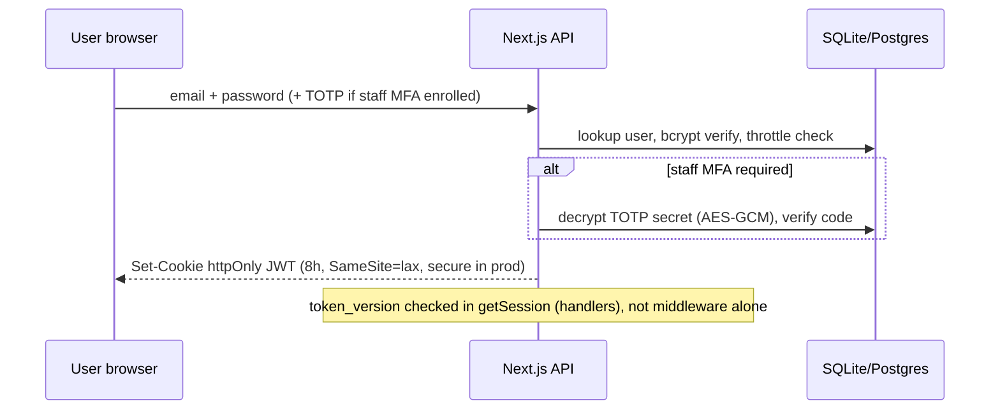
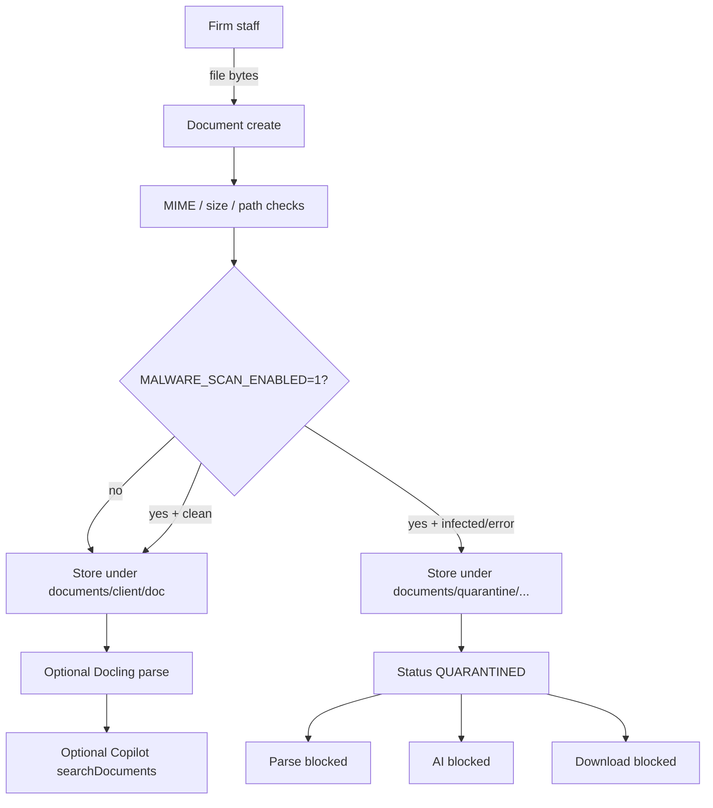
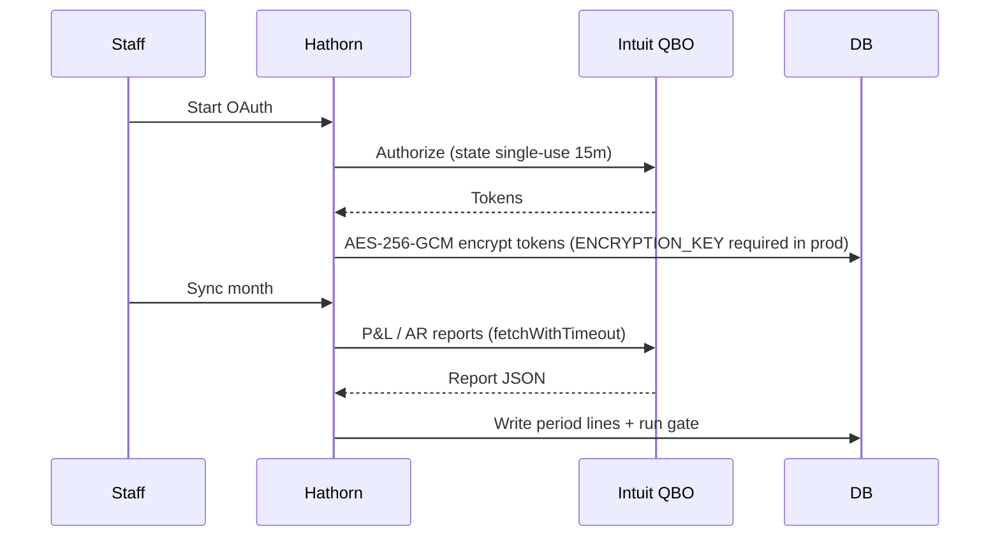

# Sensitive data flows

**Status:** DRAFT — MANAGEMENT / LEGAL REVIEW REQUIRED  
**Owner:** MANAGEMENT MUST ASSIGN  
**Scope:** Flows that actually exist in the product today. Hypothetical future vendors are omitted.

---

## Legend

```
[Actor] --> |data| [System]
```

Only CONFIDENTIAL / RESTRICTED paths are shown.

---

## 1. Authentication & session



**Data:** credentials (transient), password hash (DB), MFA secret ciphertext (DB), JWT (cookie).  
**Status:** IMPLEMENTED. Client MFA NOT IMPLEMENTED.

---

## 2. Monthly close upload → gate → publish → portal

```mermaid
flowchart LR
  BK[Bookkeeper] -->|CSV PnL Payroll AR Cash| UP[/api/upload]
  UP --> PARSE[Parse + validate year/month]
  PARSE --> DB[(Period tables)]
  DB --> GATE[lib/gate.ts]
  GATE -->|fail| GATED[GATED status]
  GATE -->|pass| REVIEW[IN_REVIEW]
  ADV[Advisor] -->|edit story| REVIEW
  ADV -->|Approve| REL[lib/release.ts snapshot]
  REL --> PUB[PUBLISHED immutable]
  CLI[Client user] -->|read only| PORTAL[/portal]
  PORTAL --> PUB
```

**Data:** financial amounts, entity names, commentary.  
**Client rule:** only PUBLISHED periods.  
**Status:** IMPLEMENTED / VERIFIED by regression suite.

---

## 3. Document upload, optional malware scan, quarantine



**Data:** arbitrary file bytes (may contain PII/tax identifiers).  
**Status:** MIME/path IMPLEMENTED; ClamAV PARTIAL (optional, default OFF); quarantine path + download block IMPLEMENTED (recent fix).

---

## 4. QuickBooks OAuth + sync



**Data:** OAuth tokens (RESTRICTED); financial report lines (CONFIDENTIAL).  
**Status:** Code IMPLEMENTED; live Intuit connection VENDOR ACTION REQUIRED / not E2E proven in this environment.

---

## 5. Copilot / tax AI (Anthropic)

```mermaid
flowchart TD
  USER[Staff or Client] -->|question| COP[/api/copilot]
  COP --> AUTH[Session + firm/client auth]
  AUTH --> TOOLS[Authorized read-only tools]
  TOOLS --> FACTS[Structured tool JSON]
  FACTS --> SAN[sanitizeAiPayload / sanitizeAiContext]
  SAN -->|redact SSN EIN bank secrets| ANTH[Anthropic API]
  ANTH --> ANS[Grounded answer + citations]
  COP --> AUD[Audit: COPILOT_QUERY metadata only — no question text]
```

**Audience split:** CLIENT tools = `getPublishedRelease`, `resolvePeriod`, `getClientInsights`, `getClientSharedForecast`, `getClientReport`, `getClientManagementQuestions` only.  
**Tax facts:** reject SSN keys.  
**Residual:** full tool JSON can still reach the model **after** sanitize.  
**Status:** IMPLEMENTED; LEGAL REVIEW REQUIRED for §7216 tax-related disclosures.

---

## 6. Email notifications (Resend)

```
[Approve/Publish or comment reply]
    -> fire-and-forget email job
    -> Resend API (if RESEND_API_KEY set)
    -> Recipient inbox
```

**Data:** client/period labels, portal links, names — not full ledgers by design.  
**Status:** PARTIAL (opt-in; no-op without key). LEGAL REVIEW for content of notices.

---

## 7. Backup & restore

```
[Cron npm run backup]
    -> SQLite online backup API
    -> BACKUP_DIR snapshot
    -> open + integrity check + row counts
    -> GFS prune

[Restore]
    -> closeDb()
    -> swap file
    -> lazy reopen
```

**Data:** entire DB including credential ciphertext and all client financials.  
**Encryption:** volume/host — NOT app-encrypted.  
**Status:** IMPLEMENTED; dated production drill evidence POLICY REQUIRED / EXTERNAL if customer-facing SLA claimed.

---

## 8. Postgres RLS (when enabled)

```
[Request] -> SET LOCAL firm/user context -> queries constrained by RLS policies
```

**Status:** Scripts + tests PARTIAL; runtime SQLite today → RLS NOT IMPLEMENTED at default runtime. See `docs/postgres-rls.sql`.

---

## Flows explicitly out of scope today

| Flow | Reason |
|---|---|
| Client MFA enrollment | NOT IMPLEMENTED |
| Signed/expiring document URLs | NOT IMPLEMENTED |
| Peer benchmarking across firms | Deliberately not built |
| Payment card processing | Not a product feature |
| PHI exchange with covered entities | Not approved (HIPAA-SCOPE) |

---

## Change control

Any new egress that may carry tax return information or taxpayer identity must update:

1. This file  
2. `docs/compliance/SECTION-7216-DATA-FLOW-REVIEW.md`  
3. `docs/compliance/SERVICE-PROVIDER-REGISTER.md`  
4. `docs/DATA-INVENTORY.md`
